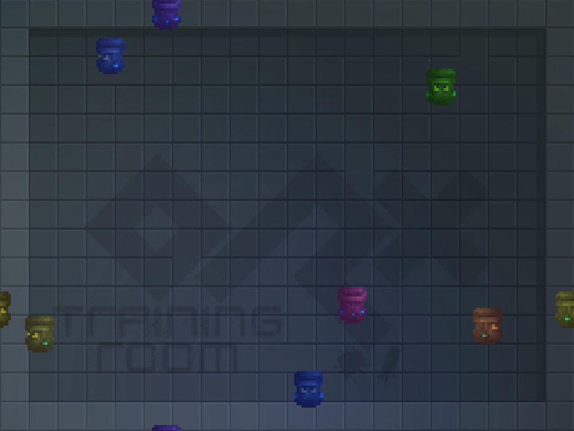

Orx Sample #1 : Seamless Screen Edge Teleportation
==================================================

This sample has been made using [orx, portable game engine](https://orx-project.org).

It is based on the template that ships with `orx` (by calling the `init` tool) with minimal modifications, as can be seen in the demonstration video: https://youtu.be/wo6o8BAMnM0

How to build
------------

In order to build this sample, you'll need to have a working installation of orx.
If you already have one, you can simply use the build files adapted to your OS/IDE in the `build/` directory.

If you do not already have installed and compiled orx, please follow those steps:

- Clone the `orx` repository at https://github.com/orx/orx
- Run `setup.bat`/`setup.sh` at its root to sync the dependencies and create the build/project files
- Use the build files in the `code/build/` directory that fit your OS/IDE and compile the `Release` configuration

You now have a working orx installation but you might need to logout/login or restart your shell/environment for the `ORX` environment variable to be updated.

Once done, simply build the `Release` configuration of this sample (note: make sure to match 32bit/64bit with the version of orx you built).

Useful links:
-------------

Website: https://orx-project.org  
Wiki: https://orx-project.org/wiki  
Code repository: https://github.com/orx/orx  
Come chat with us: https://gitter.im/orx/orx  
Forum: https://orx-project.org/forum  
Twitter: https://twitter.com/orxproject  
